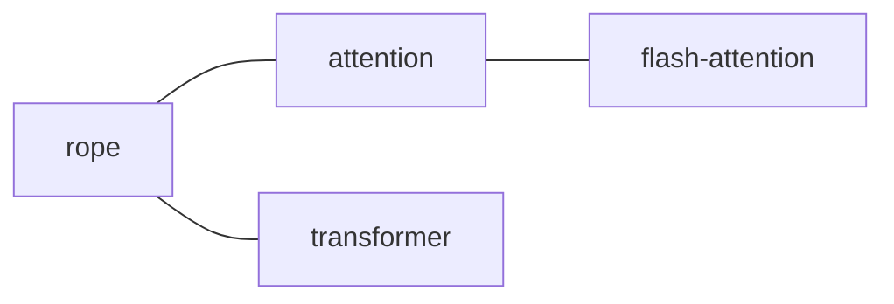

# Conversation → API patterns

Treat these as **recipes**, not scripts. The agent decides when to combine them. Every example is plain HTTP — pick whichever client your environment already has (`curl`, `fetch`, `requests`, etc.).

---

## "What does my wiki say about X?"

The single most common ask. Workflow:

1. `POST /api/v1/projects/current/search` with `{ query: X, topK: 5, includeContent: true }`
2. **Inspect `mode`** in the response to know how to read scores (see below).
3. If the top results are clearly above the rest (big gap in `score`), read those and synthesize. Otherwise read the top 3-5 and merge.
4. **Cite each `path` you used.** Quote snippets directly.
5. If nothing is found (empty `results` or a flat distribution with no clear winners), say so honestly. **Do not fabricate.**

```bash
curl -s -H "Authorization: Bearer $TOKEN" \
  -H 'Content-Type: application/json' \
  -d '{"query":"rope rotary position embedding","topK":5,"includeContent":true}' \
  $BASE/api/v1/projects/current/search
```

### How to read scores

The score's scale depends on `mode`:

| `mode` | Typical top `score` | What "good" looks like |
|---|---|---|
| `keyword` | 50–300+ (additive: filename-exact ≈ 200, phrase-in-title ≈ 50) | A clear gap (2×+) between top result and the rest. |
| `hybrid` / `vector` | 0.015–0.035 (RRF: `1/(60+rank)`-based) | Top RRF score near `0.032` ≈ matched in both keyword and vector top-1. |

**Don't apply a fixed threshold across modes.** Sort by `score` descending and rely on the relative gap. Use `vectorScore` (when present) for "how strong was the semantic match" — it's a raw similarity in `[0, 1]`, much easier to threshold than RRF.

Answer template:

> Per `wiki/concepts/rope.md` (matched via hybrid, vectorScore=0.94), rotary position embedding works by rotating Q and K vectors by an angle proportional to position. Your wiki specifically mentions …

---

## "Read me the page about X"

User wants the full text, not a synthesis.

1. If the user named a slug-like identifier (`rope`, `flash-attention`), search first with `topK: 1` to disambiguate.
2. `GET /api/v1/projects/current/files/content?path=wiki/concepts/rope.md`
3. Render the content as markdown.

```bash
PATH_REL="wiki/concepts/rope.md"
# url-encode path component
ENCODED=$(printf %s "$PATH_REL" | jq -sRr @uri)
curl -s -H "Authorization: Bearer $TOKEN" \
  "$BASE/api/v1/projects/current/files/content?path=$ENCODED"
```

In JS:

```js
const encoded = encodeURIComponent("wiki/concepts/rope.md")
const r = await fetch(`${BASE}/api/v1/projects/current/files/content?path=${encoded}`, {
  headers: { Authorization: `Bearer ${TOKEN}` },
})
const { content } = await r.json()
```

---

## "What pages link to X?" / "Show me the neighborhood of X"

1. `GET /api/v1/projects/current/graph?limit=1000` — pull the whole graph once (cheap, < 1 MB for typical projects).
2. Find `nodes[i].id === X` (or label substring match).
3. Filter `edges` for `source === X || target === X`. The other endpoint is a neighbor.

```bash
curl -s -H "Authorization: Bearer $TOKEN" "$BASE/api/v1/projects/current/graph?limit=1000"
```

You can also let the API filter for you:

```bash
curl -s -H "Authorization: Bearer $TOKEN" "$BASE/api/v1/projects/current/graph?q=rope&limit=200"
```

This applies a substring filter on `id` or `label` (case-insensitive) and returns the matching subgraph including the edges between matched nodes.

Render a small mermaid graph when the user wants a visual:



---

## "What's in my wiki?" / "Give me an overview"

Two angles:

**Structural overview** — file tree:

```bash
curl -s -H "Authorization: Bearer $TOKEN" \
  "$BASE/api/v1/projects/current/files?root=wiki&recursive=true&maxFiles=500"
```

Summarize the directory structure (`concepts/`, `entities/`, `sources/`…) and rough page counts per category.

**Topical overview** — read the curated index:

```bash
for path in wiki/index.md wiki/overview.md purpose.md; do
  encoded=$(printf %s "$path" | jq -sRr @uri)
  curl -s -H "Authorization: Bearer $TOKEN" \
    "$BASE/api/v1/projects/current/files/content?path=$encoded"
  echo
done
```

The user's `purpose.md` describes intent; `index.md` enumerates pages; `overview.md` is the AI-generated topical summary. Quote the relevant chunks.

---

## "I added new docs to the source folder — re-index"

1. `POST /api/v1/projects/current/sources/rescan`
2. Read back `changedTasks`. Report:
   - "Detected N new / M modified / K deleted files."
   - List the first ~5 file paths so the user can verify.
3. Tell the user the **actual ingest** runs asynchronously via the desktop queue — encourage them to open the Activity panel if they want progress.

```bash
curl -s -X POST -H "Authorization: Bearer $TOKEN" \
  "$BASE/api/v1/projects/current/sources/rescan"
```

If `changedTasks` is empty:

> No file changes detected. If you added files but they're not appearing, check `Settings → Source Watch` — your filters may be excluding them (e.g., `.json` is excluded by default).

---

## "Find every page that mentions Y" (broad sweep)

Search is ranked (hybrid when embeddings are configured, keyword otherwise) and capped at 50 hits per call. For **exhaustive** sweeps:

1. Run `POST .../search` with `topK: 50` and your term.
2. If the 50th result still has a non-trivial score (relative to the top), run again with a more specific query — the API will not return more than 50 in one call.
3. For **exact-string** sweeps where keyword tokenization mangles your phrase (e.g. CJK punctuation boundaries, code identifiers with underscores), walk every `wiki/*.md` via `files` + `files/content` and grep client-side. Slow but reliable.
4. Pure-semantic sweeps: set `topK: 50` and read `vectorScore` on each hit — pages without `vectorScore` matched only via keyword.

---

## "Search in my Reading project, not the current one"

When the user names a specific project rather than implying the active one.

1. List projects to resolve the name:

   ```bash
   curl -s -H "Authorization: Bearer $TOKEN" "$BASE/api/v1/projects"
   ```

   Returns:
   ```json
   {
     "projects": [
       {"id":"abc-…","name":"Research Notes","path":"/Users/me/wiki/research","current":true},
       {"id":"def-…","name":"Reading","path":"/Users/me/wiki/reading","current":false}
     ]
   }
   ```

2. Match the user's spoken name. Case-insensitive substring on `name`:

   ```js
   const projects = (await (await fetch(`${BASE}/api/v1/projects`, {
     headers: { Authorization: `Bearer ${TOKEN}` },
   })).json()).projects
   const match = projects.filter(p => p.name.toLowerCase().includes("reading"))
   ```

3. Handle ambiguity:
   - **0 matches** → tell the user, list available names, ask which one. Don't silently fall back to `current` — that would answer the wrong question.
   - **1 match** → use its `id` in all subsequent calls for this conversation.
   - **2+ matches** → ask the user to disambiguate, showing both `name` + `path`.

4. Use the resolved id directly:

   ```bash
   PROJECT_ID="def-…"   # from step 2
   curl -s -H "Authorization: Bearer $TOKEN" \
     -H 'Content-Type: application/json' \
     -d '{"query":"narrative voice","topK":5}' \
     "$BASE/api/v1/projects/$PROJECT_ID/search"
   ```

5. Cache the `id` for the rest of the conversation. Don't re-list projects on every call. Only re-resolve if the user switches contexts ("now search my Research project instead").

You can also pass the project's filesystem path directly (URL-encoded) when the user references it that way:

```bash
PROJECT_PATH=$(printf %s "/Users/me/wiki/reading" | jq -sRr @uri)
curl -s -H "Authorization: Bearer $TOKEN" \
  "$BASE/api/v1/projects/$PROJECT_PATH/files?root=wiki"
```

---

## "Compare what my Research and Reading projects say about X"

User wants cross-project synthesis.

1. `GET /api/v1/projects` once → grab both ids.
2. Search each separately with the same query:

   ```bash
   for ID in research-id reading-id; do
     curl -s -H "Authorization: Bearer $TOKEN" \
       -H 'Content-Type: application/json' \
       -d '{"query":"narrative voice","topK":3,"includeContent":true}' \
       "$BASE/api/v1/projects/$ID/search"
   done
   ```

3. Diff / contrast the result sets. Cite **both** project name and page path: *"In Research Notes (`wiki/concepts/narrative.md`)… vs. in Reading (`wiki/concepts/voice.md`)…"*.

`current` only refers to the active project; for multi-project queries always pass explicit IDs.

---

## "Switch to project X" (mid-conversation)

User has been asking about the active project, then says "now check my Reading project for the same thing."

1. Re-resolve via `GET /api/v1/projects` (or use cached list if recent).
2. Replace your cached project id for the rest of the conversation.
3. **Confirm the switch in your reply once**: *"Switching to your Reading project…"*. Don't silently apply.
4. Keep the user's query — apply it to the new project.

The desktop UI's active project does **not** change just because you used a different `{id}` — your API calls scoped to a non-current id are read-only and don't affect the user's UI state.

---

## Anti-patterns

- **Don't `POST /chat`** — it returns 501. Use the desktop chat UI, or call your own LLM with the wiki content as context.
- **Don't paginate the file tree with maxFiles=1, maxFiles=2, …** — there's no offset/cursor. Use a higher cap or filter by `root=`.
- **Don't bypass the API for writes.** The API is read-mostly. Writing to `wiki/**` or `raw/sources/**` via the filesystem directly bypasses the file-sync watcher. Use the desktop UI's Sources → Import flow or the ingest pipeline.
- **Don't include the token in URLs you echo / log / show.** Use headers in any output visible to the user.
- **Don't retry blindly on 429 / 503** — back off explicitly (1s / 2s respectively).
- **Don't shell out to a wrapper script.** The API is the contract. Direct `curl` / `fetch` is the interface.

---

## End-to-end transcript

User: *"What does my wiki say about flash attention? Show me the related concepts too."*

Agent (internally):

```bash
# 1. health + auth pre-flight
curl -s "$BASE/api/v1/health"
# → tokenSource=store, enabled=true, authConfigured=true ✓

# 2. search
curl -s -H "Authorization: Bearer $TOKEN" -H 'Content-Type: application/json' \
  -d '{"query":"flash attention","topK":5,"includeContent":true}' \
  "$BASE/api/v1/projects/current/search"

# 3. graph filter for "flash-attention" neighborhood
curl -s -H "Authorization: Bearer $TOKEN" \
  "$BASE/api/v1/projects/current/graph?q=flash&limit=200"
```

Agent (to user):

> Looking in your active project. Search ran in **hybrid mode** (tokenHits=12, vectorHits=8) — top hit `wiki/concepts/flash-attention.md` matched both keyword and vector signals (`vectorScore=0.91`).
>
> Your wiki explains FlashAttention as a memory-efficient exact attention implementation that tiles the QKV matrices to avoid materializing the full N×N attention map. Key claim: **2-4× speedup at long context on A100s** (per your wiki).
>
> Related concepts in your graph:
> - `wiki/concepts/attention.md` (parent)
> - `wiki/concepts/long-context.md` (sibling, both reachable from `flash-attention`)
> - `wiki/entities/tri-dao.md` (cited author)
>
> Want me to read any of these in full?
